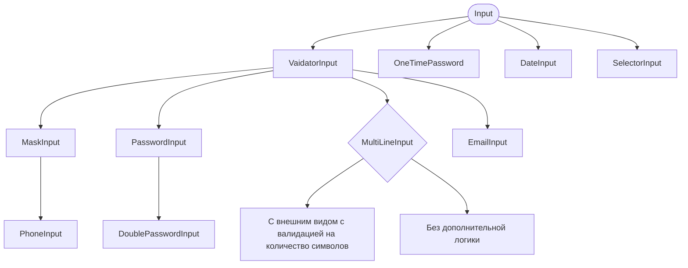

# Архитектура логики и наследования текстовых полей

`InputSamples` - Примеры использования текстовых полей
---
`Input` - Базовое текстовое поле которое определяет только внешний вид текстового поля. 
`ValidatorInput` - Наследник `Input` с логикой валидации. 
`OneTimePassword` - Наследник `Input` с логикой одноразового пароля. 
`DateInput` - Наследник `Input` с логикой даты. 
`SelectorInput` - Наследник `Input` с логикой селектора элементов. 
`MaskInput` - Наследник `ValidatorInput` с логикой маски ввода. 
`PhoneInput` - Наследник `MaskInput` логикой ввода номера телефона с помощью маски. 
`PasswordInput` - Наследник `ValidatorInput` с логикой ввода пароля. 
`DoublePasswordInput` - Группа компонентов `PasswordInput` с логикой двойного пароля. 
`EmailInput` - Наследник `ValidatorInput` с логикой ввода email. 
`MultiLineInput` - Наследник `ValidatorInput` с логикой многостраничного ввода с паттерном минимальных и максимальных символов. 
`MultiLineInput` - Наследник `ValidatorInput` с логикой многостраничного ввода без валидатора количества символов. 